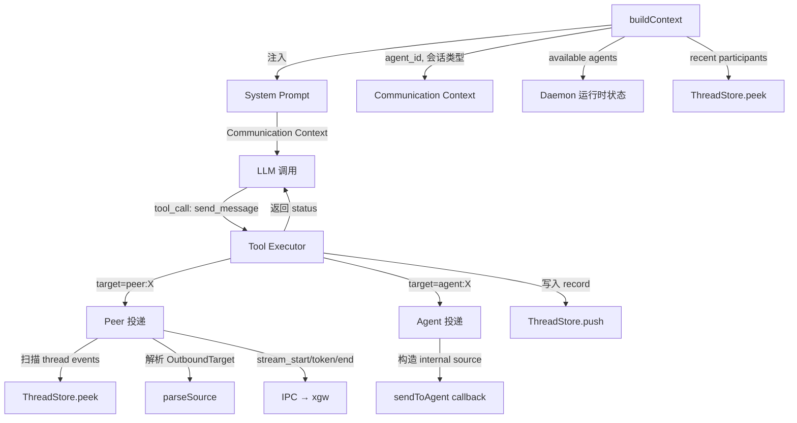

# 设计文档：send_message Tool

## 概述

本设计为 xar agent 运行时新增三个核心能力：

1. **send_message tool** — 一个注册给 LLM 的 pai Tool，使 agent 能主动向任意 peer 或 agent 发送消息
2. **Communication Context 注入** — 在 system prompt 中注入通信环境信息，让 LLM 了解当前对话性质和可用目标
3. **出站模型重构** — 移除 agent 间自动回复，对 internal 消息抑制隐式 streaming

设计遵循 ARCH.md 中定义的双出站模型：隐式 streaming（external 消息的 LLM text response 自动 stream 给 peer）+ 显式 send_message（LLM 主动调用，指定 target 和 content）。

## 架构

### 数据流



### 模块变更总览

| 文件 | 变更类型 | 说明 |
|------|---------|------|
| `src/agent/send-message.ts` | 新增 | send_message tool 实现（createSendMessageTool 工厂函数） |
| `src/agent/context.ts` | 修改 | buildContext 注入 Communication Context |
| `src/agent/run-loop.ts` | 修改 | 移除 auto-reply、internal 消息抑制隐式出站、传入 extraTools |
| `src/agent/turn.ts` | 无变更 | 已支持 extraTools 参数，无需修改 |
| `src/agent/deliver.ts` | 无变更 | send_message 复用现有 Deliver 类 |
| `src/agent/router.ts` | 无变更 | send_message 复用 parseSource |
| `src/types.ts` | 无变更 | 现有类型已满足需求 |
| `SPEC.md` | 修改 | 新增 send_message、Communication Context、双出站模型文档 |

## 组件与接口

### 1. send_message Tool（`src/agent/send-message.ts`）

新增文件，导出工厂函数 `createSendMessageTool`。

#### 工厂函数签名

```typescript
interface SendMessageDeps {
  agentId: string
  threadStore: ThreadStore
  ipcConn: IpcConnection | undefined
  sendToAgent: ((agentId: string, message: InboundMessage) => boolean) | undefined
  convId: string
  logger: Logger
  /** Per-agent stream sequence counter, shared with run-loop */
  nextStreamSeq: () => number
}

function createSendMessageTool(deps: SendMessageDeps): Tool
```

工厂函数接收运行时依赖（闭包捕获），返回符合 pai `Tool` 接口的对象。

#### Tool Schema

```typescript
{
  name: 'send_message',
  description: `Send a message to a peer or agent outside the normal streaming reply.
Use this when you need to:
- Send a message to a different target than the current conversation peer
- Send an intermediate notification before your main reply
- Dispatch a task to another agent
- Reply to an agent that delegated a task to you
Your normal text response is automatically streamed to the current peer —
you don't need send_message for that.`,
  parameters: {
    type: 'object',
    properties: {
      target: {
        type: 'string',
        description: 'Target address: "peer:<peer_id>" for humans, "agent:<agent_id>" for agents.',
      },
      content: {
        type: 'string',
        description: 'Message content.',
      },
    },
    required: ['target', 'content'],
  },
}
```

#### Handler 逻辑

```typescript
async handler(args: { target: string; content: string }): Promise<unknown> {
  const { target, content } = args
  const [prefix, id] = splitTarget(target)  // 'peer' | 'agent' | unknown

  switch (prefix) {
    case 'peer':
      return await deliverToPeer(deps, id, content)
    case 'agent':
      return await deliverToAgent(deps, id, content)
    default:
      return { status: 'error', message: 'invalid target format' }
  }
}
```

#### deliverToPeer 流程

1. 调用 `threadStore.peek({ lastEventId: 0, limit: 500 })` 获取 thread events
2. 从后往前扫描，找到 source 中包含目标 `peer_id` 的最近 external source
3. 调用 `parseSource(source)` 解析出 `channel_id`、`peer_id`、`conversation_id`
4. 构造 `OutboundTarget`
5. 生成 `stream_id`（使用 `nextStreamSeq()`）
6. 如果有 IPC 连接：通过 `Deliver` 发送 `stream_start` → `stream_token(content)` → `stream_end`
7. 写入 thread record：`{ source: 'self', type: 'record', subtype: 'message', content: JSON.stringify({ target, content }) }`
8. 返回 `{ status: 'delivered', target }`

如果找不到 peer 的 external source，返回 `{ status: 'error', message: 'peer not found in thread context' }`。

#### deliverToAgent 流程

1. 构造 internal source：`internal:agent:${convId}:${agentId}`
2. 调用 `sendToAgent(targetAgentId, { source, content })`
3. 如果 sendToAgent 返回 false（目标 agent 未运行），返回 `{ status: 'error', message: 'agent not running' }`
4. 写入 thread record：`{ source: 'self', type: 'record', subtype: 'message', content: JSON.stringify({ target, content }) }`
5. 返回 `{ status: 'delivered', target }`

#### 辅助函数

```typescript
/** 解析 target 字符串为 [prefix, id] */
function splitTarget(target: string): [string, string]

/** 在 thread events 中查找指定 peer 最近的 external source */
function findPeerSource(events: ThreadEvent[], peerId: string): string | undefined
```

### 2. Communication Context 注入（`context.ts` 修改）

#### buildContext 签名变更

```typescript
// 新增参数
export async function buildContext(
  agentId: string,
  config: AgentConfig,
  threadStore: ThreadStore,
  message: InboundMessage,
  threadId: string,
  availableAgents?: string[],  // 新增：当前运行中的 agent 列表
): Promise<ChatInput>
```

#### buildCommunicationContext 函数

新增内部函数，根据入站消息的 source 类型生成 Communication Context markdown 段：

```typescript
async function buildCommunicationContext(
  agentId: string,
  source: string,
  threadStore: ThreadStore,
  availableAgents: string[],
): Promise<string>
```

逻辑：
1. 调用 `parseSource(source)` 判断 kind
2. **external 消息**：
   - 提取 conversation_type、channel_id、peer_id
   - 如果是 group：扫描 thread recent events 提取 distinct peer_id 列表作为 recent participants
   - 生成 "Your text response will be streamed to peer:X"
3. **internal 消息**：
   - 提取 sender_agent_id、conversation_id
   - 生成 "Your text response will NOT be auto-delivered — use send_message to reply"
4. 附加 available agents 列表（排除自身）

#### 输出格式

External DM：
```markdown
## Communication Context
- You are agent: {agent_id}
- Conversation: dm with peer:{peer_id} (via {channel_id})
- Current message from: peer:{peer_id}
- Your text response will be streamed to peer:{peer_id}
- Available agents: agent:{a1}, agent:{a2}, ...
- Use send_message tool for messages to other targets
```

External Group：
```markdown
## Communication Context
- You are agent: {agent_id}
- Conversation: group {conversation_id} (via {channel_id})
- Current message from: peer:{peer_id}
- Recent participants: {p1}, {p2}, {p3}
- Your text response will be streamed to peer:{peer_id}
- Available agents: agent:{a1}, agent:{a2}, ...
- Use send_message tool for messages to other targets
```

Internal：
```markdown
## Communication Context
- You are agent: {agent_id}
- Message from: agent:{sender_agent_id} (conversation: {conversation_id})
- Your text response will NOT be auto-delivered — use send_message to reply
- Available agents: agent:{a1}, agent:{a2}, ...
- Use send_message(target='agent:{sender_agent_id}', content='...') to reply
```

### 3. run-loop.ts 修改

#### 移除 auto-reply

删除 `processMessage` 末尾的 "Agent-to-agent auto-reply" 代码块（约 20 行，从 `const parsedSource = parseSource(msg.source)` 到 `}` 结束）。

#### Internal 消息隐式出站抑制

修改 `processMessage` 中的 Deliver/IpcChunkWriter 创建逻辑：

```typescript
const isInternal = parseSource(msg.source).kind === 'internal'

// 隐式出站：仅 external 消息创建 deliver 和 chunkWriter
let deliver: Deliver | null = null
let chunkWriter: IpcChunkWriter | null = null

if (target && !isInternal) {
  streamId = this.nextStreamId(target)
  if (conn) {
    deliver = new Deliver(conn, target)
    chunkWriter = new IpcChunkWriter(conn, streamId)
  }
} else {
  streamId = `internal:${this.agentId}:${this.streamSeq++}`
}
```

当前代码已经有 `isInternal` 检查但只用于 warn 日志，需要扩展为完全抑制 deliver 和 chunkWriter 创建。

#### 传入 send_message extraTools

在 `processMessage` 中创建 send_message tool 并通过 `extraTools` 传入 `processTurn`：

```typescript
import { createSendMessageTool } from './send-message.js'

// 在 processTurn 调用前
const sendMessageTool = createSendMessageTool({
  agentId: this.agentId,
  threadStore,
  ipcConn: conn,
  sendToAgent: this.sendToAgent,
  convId,
  logger: this.logger,
  nextStreamSeq: () => ++this.streamSeq,
})

const result = await processTurn({
  // ... existing params
  extraTools: [sendMessageTool],
})
```

#### buildContext 调用更新

传入 availableAgents 参数。run-loop 需要从 daemon 获取当前运行中的 agent 列表。通过构造函数新增一个 `getRunningAgents` 回调：

```typescript
constructor(
  // ... existing params
  private getRunningAgents?: () => string[],
)
```

Daemon 在创建 RunLoopImpl 时传入：

```typescript
const runLoop = new RunLoopImpl(
  agentId, queue, this.ipcConnections, this.pai!, agentLogger,
  (targetId, message) => { /* sendToAgent */ },
  () => Array.from(this.agents.keys()),  // getRunningAgents
)
```

### 4. Daemon 修改（`daemon/index.ts`）

仅需在 `RunLoopImpl` 构造时传入 `getRunningAgents` 回调。

## 数据模型

### send_message Tool 参数

```typescript
interface SendMessageArgs {
  target: string   // 'peer:<peer_id>' | 'agent:<agent_id>'
  content: string  // 消息内容
}
```

### send_message Tool 返回值

```typescript
// 成功
{ status: 'delivered', target: string }

// 失败
{ status: 'error', message: string }
```

### Thread Record（send_message 写入）

```typescript
{
  source: 'self',
  type: 'record',
  subtype: 'message',
  content: JSON.stringify({ target: string, content: string })
}
```

### Communication Context 数据来源

| 信息 | 来源 | 获取方式 |
|------|------|---------|
| agent_id | 当前 agent 配置 | 构造函数参数 |
| conversation type/id | 入站消息 source | `parseSource(source)` |
| peer_id | 入站消息 source | `parseSource(source)` |
| recent participants | thread events | `threadStore.peek()` + 提取 distinct external peer_id |
| available agents | daemon 运行时 | `getRunningAgents()` 回调 |


## 正确性属性

*正确性属性（Correctness Property）是系统在所有合法执行路径上都应成立的特征或行为——本质上是对"系统应该做什么"的形式化陈述。属性是人类可读规格与机器可验证正确性保证之间的桥梁。*

### Property 1: findPeerSource 返回最近的 external source

*For any* thread event 序列，其中包含多个来自同一 peer_id 的 external source 事件，`findPeerSource(events, peerId)` 应返回该 peer_id 最后一次出现的 external source 地址。

**Validates: Requirements 1.2**

### Property 2: 成功投递写入 record 并返回 delivered

*For any* 有效的 send_message 调用（target 格式正确且目标可达），handler 应同时满足：(a) 向 thread 写入一条 `{ source: 'self', type: 'record', subtype: 'message' }` 事件，且 content 包含 target 和 content；(b) 返回 `{ status: 'delivered', target }`。

**Validates: Requirements 1.5, 1.6**

### Property 3: 无效 target 格式返回 error

*For any* 不以 `peer:` 或 `agent:` 开头的 target 字符串，send_message handler 应返回 `{ status: 'error', message: 'invalid target format' }`，且不写入任何 thread record，不触发任何投递。

**Validates: Requirements 1.7**

### Property 4: internal source 地址构造格式正确

*For any* agent_id、conv_id 和 self_agent_id 组合，deliverToAgent 构造的 internal source 地址应严格遵循 `internal:agent:{conv_id}:{self_agent_id}` 格式，且各段均为小写。

**Validates: Requirements 1.4**

### Property 5: external 消息的 Communication Context 包含必要字段

*For any* 有效的 external source 地址和 available agents 列表，生成的 Communication Context 应包含：agent 身份、会话类型（dm/group）、渠道信息、当前 peer、streaming 提示（"will be streamed to peer:X"）、以及所有 available agents。

**Validates: Requirements 3.2, 3.4**

### Property 6: internal 消息的 Communication Context 包含必要字段

*For any* 有效的 internal source 地址和 available agents 列表，生成的 Communication Context 应包含：agent 身份、来源 agent、"will NOT be auto-delivered" 提示、以及 send_message 回复示例。

**Validates: Requirements 3.3, 3.4**

### Property 7: group 会话的 Communication Context 包含 recent participants

*For any* group 类型的 external source 和包含多个不同 peer_id 的 thread event 序列，生成的 Communication Context 应包含 "Recent participants" 行，列出所有 distinct peer_id。

**Validates: Requirements 3.5**

### Property 8: stream_id 格式遵循约定

*For any* 有效的 OutboundTarget（channel_id、conversation_id）和 sequence number，生成的 stream_id 应严格遵循 `{channel_id}:{conversation_id}:{seq}` 格式。

**Validates: Requirements 6.3**

## 错误处理

| 场景 | 处理方式 |
|------|---------|
| target 格式无效 | 返回 `{ status: 'error', message: 'invalid target format' }`，不抛异常 |
| peer 在 thread 中找不到 | 返回 `{ status: 'error', message: 'peer not found in thread context' }`，不抛异常 |
| 目标 agent 未运行 | 返回 `{ status: 'error', message: 'agent not running' }`，不抛异常 |
| IPC 连接不可用（peer 投递） | 返回 `{ status: 'error', message: 'no IPC connection available' }`，不抛异常 |
| IPC 发送失败 | 捕获异常，返回 `{ status: 'error', message: '<error detail>' }`，记录日志 |
| thread 写入失败 | 捕获异常，记录日志，仍返回投递结果（投递已完成） |

所有错误均通过返回值传递给 LLM，不抛异常中断 tool call 流程。这与 bash_exec 的错误处理模式一致（返回 exitCode + stderr，不抛异常）。

## 测试策略

### 测试框架

- 单元测试 + 属性测试：vitest + fast-check
- 属性测试最少 100 次迭代

### 属性测试（PBT）

每个 correctness property 对应一个 PBT 测试，使用 fast-check 生成随机输入：

| Property | 测试文件 | Generator 策略 |
|----------|---------|---------------|
| P1 findPeerSource | `vitest/pbt/send-message.pbt.test.ts` | 生成随机 ThreadEvent[]，包含随机 external/internal/self source |
| P2 成功投递 | `vitest/pbt/send-message.pbt.test.ts` | 生成随机 peer/agent target + content，mock threadStore 和 IPC |
| P3 无效 target | `vitest/pbt/send-message.pbt.test.ts` | 生成不以 peer:/agent: 开头的随机字符串 |
| P4 internal source 格式 | `vitest/pbt/send-message.pbt.test.ts` | 生成随机 agent_id、conv_id 组合 |
| P5 external Communication Context | `vitest/pbt/communication-context.pbt.test.ts` | 生成随机 external source + agent 列表 |
| P6 internal Communication Context | `vitest/pbt/communication-context.pbt.test.ts` | 生成随机 internal source + agent 列表 |
| P7 group participants | `vitest/pbt/communication-context.pbt.test.ts` | 生成随机 group source + 多 peer events |
| P8 stream_id 格式 | `vitest/pbt/send-message.pbt.test.ts` | 生成随机 channel_id、conversation_id、seq |

### 单元测试

| 测试文件 | 覆盖内容 |
|---------|---------|
| `vitest/unit/send-message.test.ts` | tool schema 验证、peer 投递 IPC 序列（stream_start/token/end）、agent 投递 sendToAgent 调用、peer not found edge case、agent not running edge case |
| `vitest/unit/communication-context.test.ts` | DM/group/internal 三种场景的完整输出验证、空 agent 列表 edge case |

### 测试标注

每个属性测试必须包含注释引用设计文档中的 property：

```typescript
// Feature: send-message-tool, Property 1: findPeerSource 返回最近的 external source
// Validates: Requirements 1.2
```
